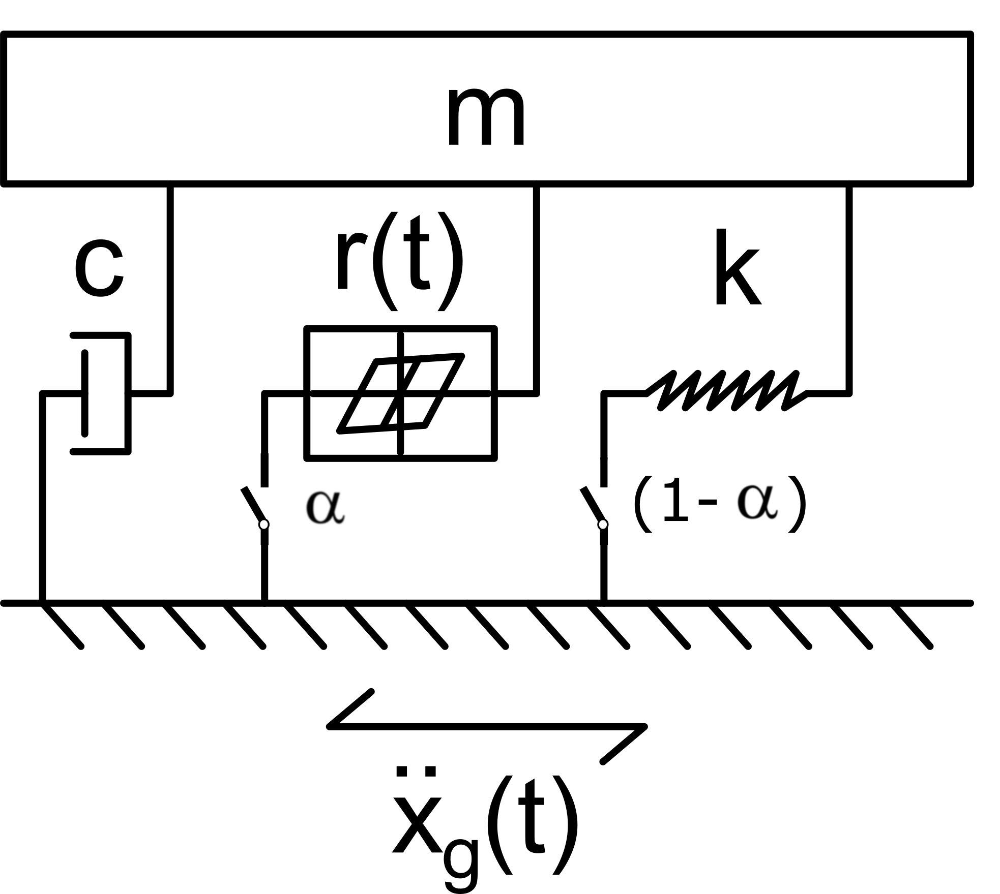

# A Comparative Bayesian Model Calibration Example for Nonlinear System Identification
The purpose of this example is to compare the performance of various approximations to the Bayesian model calibration problem. Specifically, we compare the Extended and Unscented Kalman Filters (analytical approximations, as developed in the library FilterPy1), the SMC2 algorithm (sampling approximation, as developed in the library particles2), and the automatic differentiation variational inference algorithm (optimization-based approximation, as developed by Kucukelbir et al.3 and developed using the library PyTorch4). 

In this example we identify the model calibration parameters of a single degree of freedom oscillator with a nonlinear Bouc-Wen switch component, as shown below. 

Details on the construction of the calibration model are given in notebook file **BW-SDOF.ipynb**. The control inputs and system responses used for model calibration are generated in the file **Generate_Input.ipynb**. Identification of the system is performed for the system under the conditions &alpha; = 0, denoting a fully linear system, and &alpha; = 1, denoting a nonlinear Bouc-Wen system. The implementation of the approximate calibration algorithms is split between these two cases, and are available in the folders **Linear** and **Bouc-Wen** in separate notebooks according to the algorithm used (EKF, UKF, SMC2, and ADVI). Results from these algorithms can be visualized using the file **Visualize_Results.ipynb**.  To the extent possible, example results from running the included algorithms are stored in the respective **04-Data** folders. Some sets of the results for the nonlinear switch case are too large to be hosted in this repository, but can easily be generated by running the respective codes.

**Note: This example is currently being prepared. The final version of all files will be posted shortly**

# Running this Example
This example was developed in Python 3.7 and implemented using a variety of probabilistic programming packages, which are listed in the Reference section. Running this example requires the installation of these packages, as well as numpy and matplotlib. The environment used to develop this example has been provided in the file **BayesianID.yml**

# References
1 R. Labbe, FilterPy v1.4.5, (2021). [https://github.com/rlabbe/filterpy](https://github.com/rlabbe/filterpy).

2 N. Chopin, particles v0.1, (2021). [https://github.com/nchopin/particles](https://github.com/rlabbe/filterpy).

3A. Kucukelbir, D. Tran, R. Ranganath, A. Gelman, D.M. Blei, Automatic differentiation variational inference, J. Mach. Learn. Res. 18 (2017) 430–474.

4 A. Paszke, S. Gross, F. Massa, A. Lerer, J. Bradbury, G. Chanan, T. Killeen, Z. Lin, N. Gimelshein, L. Antiga, A. Desmaison, A. Köpf, E. Yang, Z. DeVito, M. Raison, A. Tejani, S. Chilamkurthy, B. Steiner, L. Fang, J. Bai, S. Chintala, [PyTorch: an imperative style, high-performance deep learning library](https://pytorch.org/) in: Adv. Neural Inf. Process. Syst., 2019: pp. 8024–8035. http://arxiv.org/abs/1912.01703.

# Citing this Work
Lund, A., I. Bilionis, S.J. Dyke. (2021) "A Comparative Bayesian Model Calibration Example for Nonlinear System Identification." 

# License

GNU General Public Licence v3.0

# Feedback
Any questions, comments, or other issues with this example can be directed to [Alana Lund](mailto:alund15@purdue.edu). 
